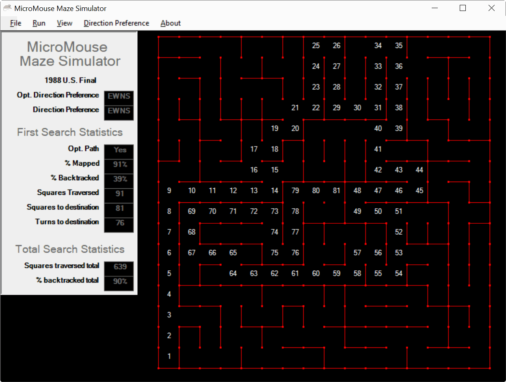

# MicroMouse
MicroMouse Simulator

This simulator runs all sixteen direction preferences and compiles statistics for each. Find the direction preference that solves for the shortest path to the center of the maze. Or maybe your battery runtime is low and you want to find the direction preference that gives the minumum number of squares traversed to reach the center. You can also experiment by customizing your own maze using a simple text file.

Instructions:
1. Download .msi file from this repository. Install on your computer.
2. Use File/Open in the menu to select a .map maze file from the application directory.
3. Select Run in the menu. Application will run through sixteen direction preferences compiling data for each run. This will take anywhere from 3-5 seconds depending on the speed of your computer.
4. All sixteen direction preferences are selectible from the menu. Some direction preferences are more desireable than others based on run statistics.

In addition to the .map files located in the installation directory, you can create and simulate your own .map files.

.map file definitions
Line 1: maze title in quotes, example "Practice Maze"
Lines 2 through 17: 16 comma delimited integers

Integer definitions:
1 - west wall,
2 - east wall,
3 - west and east walls,
4 - south wall,
5 - west and south walls,
6 - south and east walls,
7 - west, south and east walls,
8 - north wall,
9 - west and north walls,
10 - east and north walls,
11 - west, east and north walls,
12 - south and north walls,

The below image shows the simulator state after it has ran all 16 direction preferences

The below image shows the simulator state after selecting the optimum direction preference giving the shortest path to the center of the maze.

